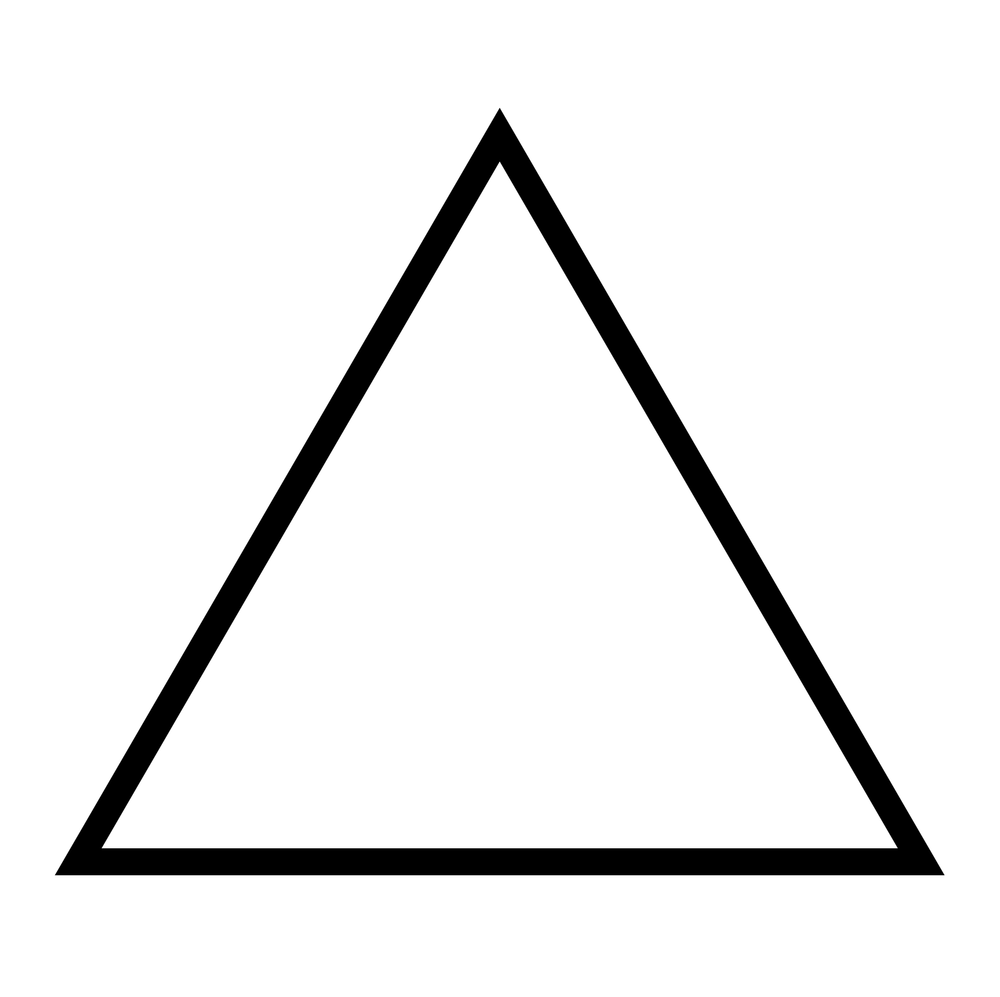
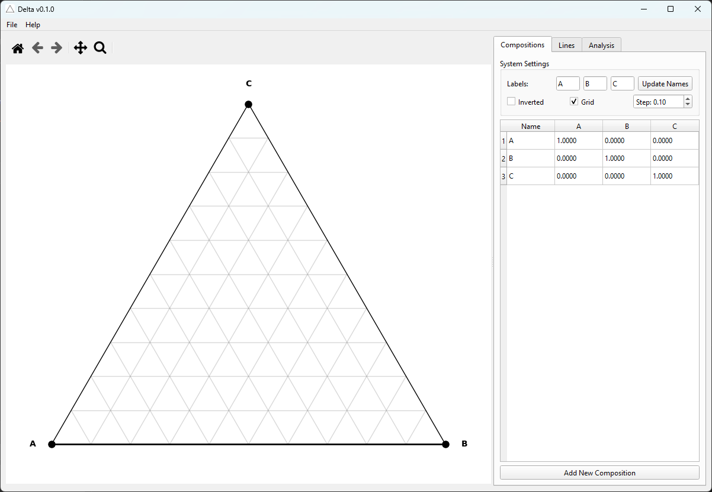

<div align="center">
  
  <h1>Delta</h1>
</div>

**Delta** — это инструмент для построения, визуализации и анализа тройных диаграмм состояния (Треугольник Гиббса). Приложение разработано для химиков, материаловедов и инженеров, работающих с многокомпонентными системами.


---

## 🖼️ Скриншот приложения

<div align="center">
  
  <p><em>Интерфейс Delta</em></p>
</div>

---

## ✨ Возможности

### 📊 Визуализация
- **Интерактивный треугольник Гиббса:** Масштабирование (Zoom), перемещение (Pan) и навигация.
- **Поддержка режимов:** Стандартный треугольник и перевернутый (Inverted).
- **Стилизация:** Полная настройка маркеров (форма, цвет, размер) и линий (тип штриха, толщина).
- **Экспорт:** Сохранение графиков в высоком качестве для публикаций.

### 🧪 Анализ и Расчеты
- **Правило рычага (Lever Rule):**
    - **Линейный режим:** Расчет долей фаз на коноде (Tie-line).
    - **Тройной режим:** Расчет долей в трехфазной области (треугольнике).
- **Поиск пересечений:** Автоматическое нахождение точки пересечения двух конод.
- **Проверка коллинеарности:** Умная валидация принадлежности точки выбранной линии.
- **Стехиометрия:** Автоматический подбор целочисленных коэффициентов с точностью 0.001 мол.%.
- **Научная точность:** Поддержка сложных интерметаллидов (Mg₁₇Al₁₂, Cu₅Zn₈ и др.) без ограничений на индексы.

### 🛠 Архитектура
- **Надежность:** Строгая типизация (mypy), DTO для передачи данных.
- **Современный стек:** `PySide6` (Qt), `Matplotlib`, `NumPy`.
- **Логирование:** Подробные логи через `loguru` с ротацией и архивацией.
- **Управление проектом:** Сохранение и загрузка в формате JSON с валидацией версий.

### 📖 Документация
- **[📖 Руководство пользователя](MANUAL.md)** — Подробное руководство по всем функциям приложения, интерфейсу и анализу данных.
- **[🐍 Headless API](HEADLESS_API.md)** — Программный интерфейс для работы без GUI (скрипты, автоматизация, Jupyter).

### 🔬 Научная Точность

Delta разработан для профессиональных научных исследований и соответствует требованиям высокоточных материаловедческих расчетов:

- **Математическое ядро:** Аналитические формулы вместо численных методов для исключения ошибок округления
- **Точность стехиометрии:** 0.001 моль.% с поддержкой сложных интерметаллидов (Mg₁₇Al₁₂, Cu₅Zn₈, A₁₀₁B₁ и др.)
- **Аналитическая геометрия:** Прямые и обратные преобразования без накопления погрешностей
- **Векторные операции:** Пересечение линий через векторные произведения, устойчивые к вырожденным случаям
- **Clamping шума:** Автоматическое устранение микро-погрешностей (1e-17 → 0.0) для корректной стехиометрии
- **Точное суммирование:** Использование `math.fsum()` для исключения ошибок при нормализации составов

**Примеры работы:**
- **Al₂O₃** → `[2, 3]` (точное соотношение)
- **Mg₁₇Al₁₂** → `[17, 12]` (сложный интерметаллид)
- **A₁₀₁B₁** → `[101, 1]` (большие индексы без ограничений)
- **Нестехиометрические составы** → высокоточные значения в масштабе 100,000

## 🐍 Программный доступ (Headless API)

Delta можно использовать как Python-библиотеку без запуска GUI:

```python
from delta import Diagram

d = Diagram(components=["NaCl", "KCl", "H₂O"])
d.add_point("Eutectic", 0.33, 0.33, 0.34, color="red")
d.save_image("diagram.png", dpi=300)
```

**Установка для headless-режима:**

```bash
git clone https://github.com/your-username/delta.git
cd delta
uv pip install -e .  # Без Qt-зависимостей
```

**Возможности API:**
- Создание диаграмм без Qt-зависимостей
- Пакетная генерация изображений
- Интеграция в пайплайны обработки данных
- Работа в Jupyter notebooks

👉 **[Полная документация Headless API](HEADLESS_API.md)**

---

## 📦 Зависимости

### Базовые (headless)
- **NumPy** — математические вычисления
- **Matplotlib** — построение графиков
- **Pydantic** — валидация данных
- **Loguru** — логирование

### GUI (опционально)
- **PySide6** — графический интерфейс (Qt)
- **Markdown** — отображение документации

### Разработка
- **PyInstaller** — сборка в standalone-приложение
- **uv** — менеджер пакетов и окружений

> 💡 Для headless-режима: `uv pip install -e .`  
> Для GUI: `uv pip install -e ".[gui]"`

---

## 🚀 Установка и Запуск

Проект использует современный менеджер пакетов **[uv](https://github.com/astral-sh/uv)**. Это обеспечивает молниеносную установку и изолированное окружение.

### Предварительные требования
1. Установите `uv` (если еще не установлен):
   ```bash
   # Windows (PowerShell)
   powershell -c "irm https://astral.sh/uv/install.ps1 | iex"

   # macOS / Linux
   curl -lsSf https://astral.sh/uv/install.sh | sh
   ```

### Запуск проекта
1. Склонируйте репозиторий:
   ```bash
   git clone https://github.com/your-username/delta.git
   cd delta
   ```

2. Инициализируйте окружение и запустите:
   ```bash
   uv run main.py
   ```
   *(Команда автоматически создаст виртуальное окружение, скачает все зависимости и запустит приложение)*.

### Альтернативный запуск
Если вы хотите установить зависимости в текущее окружение:
```bash
uv pip install -e .
uv run delta
```

---

## 🔧 Сборка и Дистрибуция

Для создания standalone Windows приложения используется PyInstaller.

### Процесс сборки
1. Запустите скрипт сборки:
   ```bash
   .\build.cmd
   ```

2. Готовое приложение будет создано в папке `dist/Delta/`

### Что делает сборка
- Генерирует иконку приложения из `icon.svg` в `icon.ico`
- Создает splash screen с версией приложения
- Собирает все зависимости в standalone exe файл
- Настраивает правильную работу matplotlib внутри PyInstaller
- Убирает консольное окно (GUI приложение)

### Структура сборки
- **delta.spec** - Конфигурация PyInstaller с настройками
- **tools/make_icon.py** - Генерация иконки из SVG
- **tools/make_splash.py** - Генерация splash screen
- **build.cmd** - Скрипт автоматической сборки

---

## 📝 Лицензия

Этот проект распространяется под лицензией MIT. Подробнее см. файл `LICENSE`.

---

**Автор:** Юрьев Илья Олегович
**Email:** i.o.yurev@ya.ru
